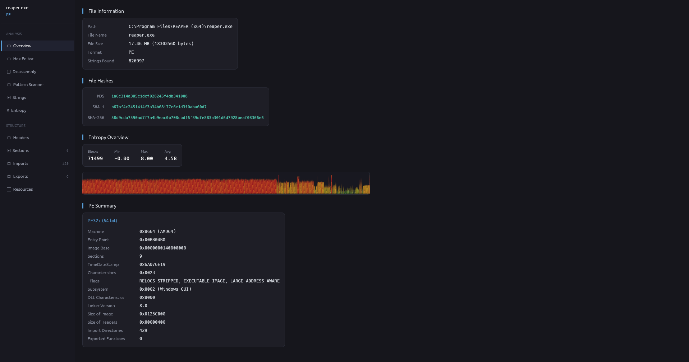
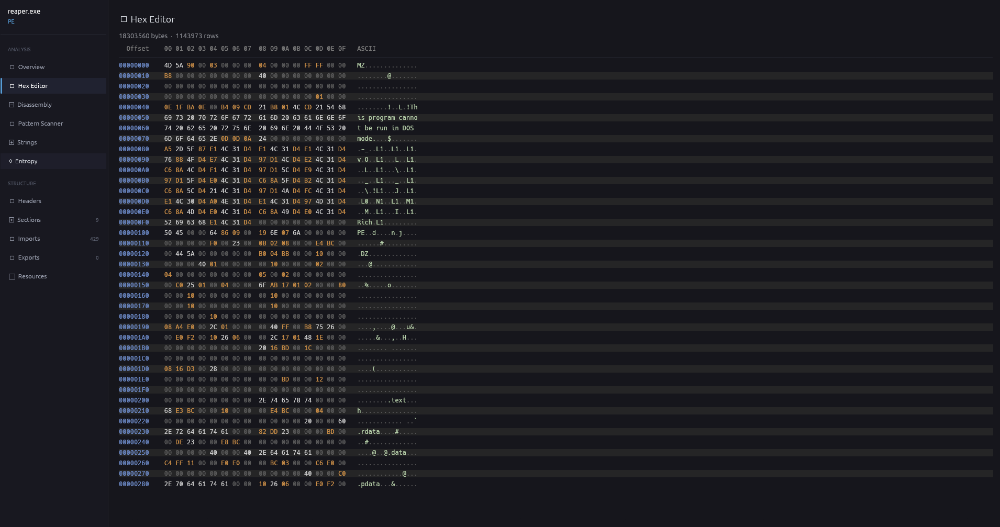
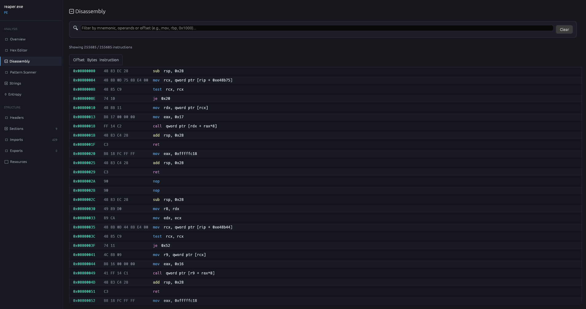

# Universal Disassembler

Universal Disassembler is a binary analysis tool written in Rust.

The goal of this project is to create a lightweight multi-format binary analyzer while learning Rust and low-level concepts.

## Features

### Binary Formats

- [x] PE (Windows)
- [x] ELF (Linux)
- [x] Mach-O (macOS)
- [x] Raw binary fallback

If the file format cannot be identified, it will be loaded as a raw binary.

---

### Analysis

- [x] Disassembler (Capstone powered)
- [x] Entropy analysis
- [x] Pattern scanner
  - [x] Hex pattern support
  - [x] Wildcards (`??`)
- [x] String search

---

### Editing

- [ ] Byte patching
- [ ] Hex editor

---

## Tech Stack

- Rust
- eframe / egui
- Capstone Engine

## Dependencies

- `capstone` — disassembly engine
- `eframe` — GUI framework

## Screenshots

## Purpose

This project was created as a way to learn Rust, binary formats, reverse engineering concepts and low-level programming.

## License

MIT